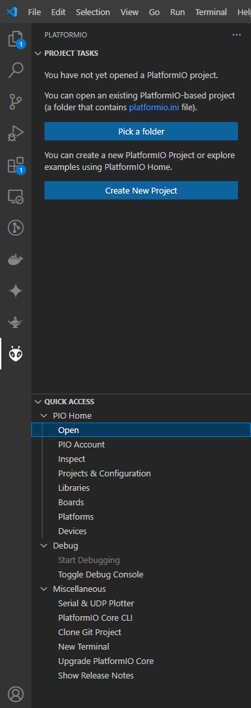
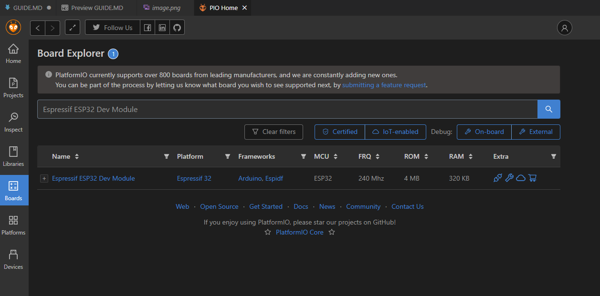
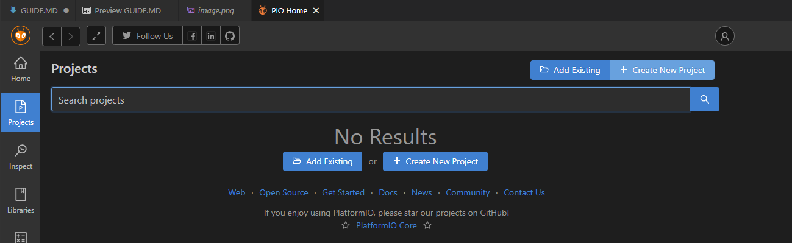
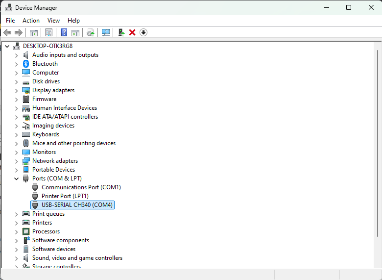

- Install PlatformIO VSCode extention
- Open PlatformIO tab
- Go to PIO Home >> Open under Quick Access 




Go to Boards tab. Search for Espressif ESP32 Dev Module



Go To Project tab, Create New Project



Insert this line to platformio.ini
```
monitor_speed = 115200
```

The platformio.ini file should look like this: 

```
[env:esp32dev]
platform = espressif32
board = esp32dev
framework = arduino
monitor_speed = 115200

[platformio]
description = Setup Guide
```

Hook up the ESP32 dev board via USB-C cable. 
Make sure ESP32 dev board is connected. Open Device Manager. Check that the board is recognized via COM port.
